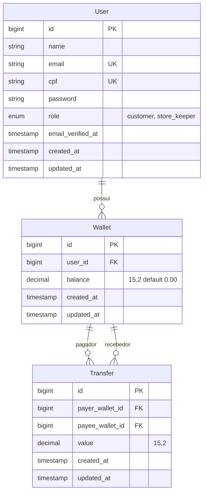

# Simple Fintech - Laravel API

Essa API é um projeto realizado como fruto de um desafio técnico, então proposta dele é apenas desenvolver uma rota `POST /api/transfer` que recebe apenas um `id` do pagante, outro do pagador e um valor.

## Como iniciar o projeto

Esse projeto foi construído para uma máquina com `php` na versão 8.2, `composer` e `mysql` na versão 8.4, lembre-se de modificar o `.env` para incluir suas configurações de banco de dados.

```bash
composer setup
php artisan db:seed
composer run dev
```

Ou `docker`, `php` e `composer` caso queria usar o `sail`:

```bash
composer install
./vendor/bin/sail up -d
./vendor/bin/sail artisan migrate --seed
```

## Diagrama de Entidades

A modelagem da entidade foi realizada de forma simples, mas de modo estendível. Dessa forma, fica simples para a implementação de um usuário com várias carteiras, para extender o sistema para comportar várias moedas ou caixinhas.



## Documentação da Rota

O projeto usa o Swagger como forma de documentar sua rotas, anotando na própria _controller_ suas resposta possíveis, usando o pacote `darkaonline/l5-swagger` para gerar a `opeapi.json` e sua página corresponde.

A documentação está acessível através de [http://localhost/api/documentation](http://localhost/api/documentation).

## Testes

A aplicação conta com testes de integração, testando a rota do caso de sucesso, várias formas de corpo da requisição inválido, falha na integração com um serviço de autenticação e notificação.

Use os comandos abaixo para executar os testes:

```bash
php artisan test
# ou usando sail
./vendor/bin/sail artisan test
```

## Ferramentas de Qualidade

O projeto utiliza ferramentas para garantir a qualidade e consistência do código:

### Laravel Pint

Ferramenta de formatação de código baseada no PHP-CS-Fixer, seguindo os padrões PSR-12 e as convenções do Laravel.

```bash
# Formatar todo o código
composer format

# Verificar formatação sem alterar arquivos
./vendor/bin/pint --test
```

### PHPStan

Ferramenta de análise estática que detecta erros em código PHP sem executá-lo.

```bash
# Executar análise estática
composer analyse

# Ou diretamente
./vendor/bin/phpstan analyse
```

### Executar todas as verificações

```bash
# Executa formatação e análise estática
composer quality
```
